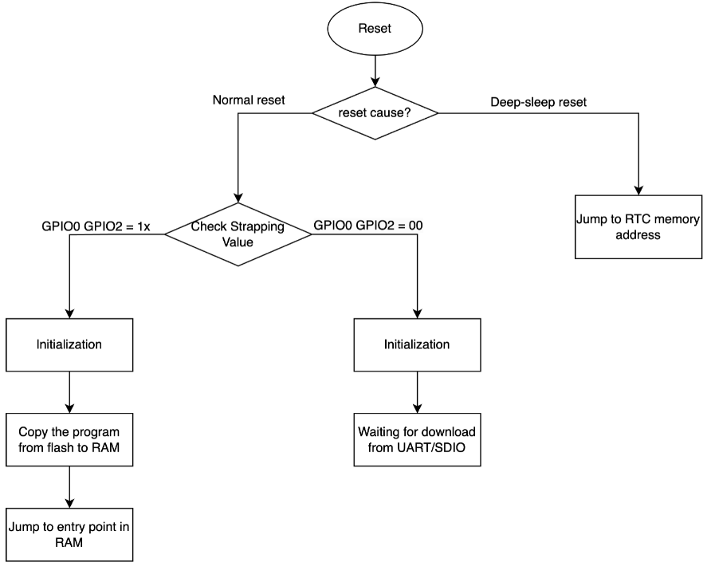

# TASK MINGGU 1

- [x] Melakukan instalasi dan konfigurasi ESP-IDF menggunakan command line
- [x] Membuat projek sederhana
- [x] Menjelaskan bagaimana alur mulai esp32

## Instalasi dan konfigurasi

Lakukan beberapa install dependency linux untuk menjalankan ESP-IDF\
`sudo apt-get install git wget flex bison gperf python3 python3-pip python3-venv cmake ninja-build ccache libffi-dev libssl-dev dfu-util libusb-1.0-0` 

Ketika selesai lanjut untuk melakukan pengunduhan ESP-IDF \
`mkdir ~/esp && cd ~/esp`/
`git clone -b v5.5.2 --recursive https://github.com/espressif/esp-idf.git`

> untuk versi ESP-IDF disesuaikan dengan versi python, jika ingin menggunakan versi terbaru dari ESP-IDF maka menggunakan python terbaru untuk meminimalisir error.

Instalasi ESP-IDF\
`cd esp-idf/`\
`./install.sh`

Jika berhasil lakukan, set up environment \
`. $HOME/esp/esp-idf/export.sh`

Beberapa perintah untuk menjalankan perintah \
`idf.py build` build program \
`idf.py flash` flash program ke esp \
`idf.py monitor` membuka monitor 

perintah dapat digabung seperti ini \
`idf.py flash monitor` akan melakukan build, flash dan membuka monitor.

## Proses ESP32 Boot

Ada beberapa tahapan yang akan dilalui esp, yaitu: 
   1. First stage (ROM) bootloader
   2. Second stage bootloader
   3. Application setup
   
### 1) First stage
Pada fase First tage (ROM) Bootloader,akan melakukan pengecekaan apa dia deep reset atau normal reset.

- Reset dari deep sleep: Jika nilai `RTC_CNTL_STORE6_REG`  bukan bernilai 0 dan  `RTC_CNTL_STORE7_REG` nilai cnc dari RTC valid maka akan menggunakan `RTC_CNTL_STORE6_REG` sebagai entry point, Jika `RTC_CNTL_STORE6_REG` bernilai 0 atau cnc tidak valid pada `RTC_CNTL_STORE7_REG` maka akan melanjutkan proses ke normal boot.
  
- Power-on reset, software SoC reset dan watchdog: Melakukan pengecekan pada register `GPIO_STRAP_REG` jika dia custom boot (seperti UART Download Mode)
   
|Boot Mode |GPIO0|GPIO2|
|-|-|-|
|SPI Boot Mode|1|Any Value|
|Join Download Boot Mode|0|0|

> sumber espressif docs

### 2) Second stage bootloader
Pada second stage bootloader akan membaca partition table untuk mengetahui di mana letak aplikasi. Jika ada fitur OTA, akan melakukan pengecekan partisi `otadata` untuk melihat apakah harus menjalankan OTA lama atau OTA baru.

### 3) Application setup
Setelah mengetahui dimana letak kode aplikasi maka akan dilanjutkan dengan persiapan awal apliasi.
Pada tahap persiapan aplikasi, akan melakukan 3 bagian yaitu:
1. Inisiasi PORT dan environment runtime c
2. Inisiasi sistem service dan FreeRTOS
3. Menjalankan tugas utama dan memanggil fungsi app_main.

#### PORT Initialization
Pada bagian ini merupakan hal krusial dikarenakan akan menjalankan beberapa hal seperti, inisiasi CRT (C runtime environment), inisiasi internal memori, jika menggunakan memori eksternal maka akan dinyalakan, mengatur CPU clock dan lain-lain.

#### System Initialization
Pada bagian ini akan melakukan inisiasi dari alokasi memori, persiapan awal untuk stdin, stdout, stderr , inisiasi SPI flash dan lain-lain.

#### Running the Main Task
Seletah semua komponen di inisiasikan, tugas utama akan di buat dan penjadwalan FreeRTOS akan dimulai