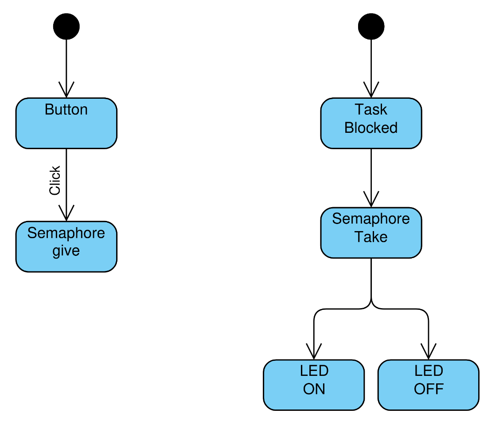

# TASK MINGGU 2

- [x] Implement LED blinking using polling.
- [x] Implement LED blinking using a hardware timer.
- [x] Read button input with software debounce.
- [x] Configure button input using interrupt.
- [x] Implement LED behavior controlled by a state machine.
- [x] Create a state machine diagram.

## GPIO AND TIMING  
Polling, hardware timer and software debounce memiliki perbedaannya, salah satu nya dalam segi waktu.

Polling merupakan metode dimana CPU/task secara aktif dan terus-menerus mengecek status hardware atau kondisi tertentu untuk mengetahui apakah sebuah event sudah terjadi atau belum. 

Hardware timer merupakan perangkat keras di dalam mcu untuk menghitung pulsa clock. Timer bekerja berbasis hardware sehingga dapat berjalan secara independen tanpa membebani CPU.

Software Debounce adalah mekanisme berbasis kode program yang digunakan untuk mengatasi noise atau bouncing pada perangkat keras.

Perbedaan antara ketika ke-3 ini yaitu:
1. Polling akan melakukan pengecakkan terus menerus terhadap tombol apakah button ditekan atau tidak, metode ini membuat beban kerja CPU karena cpu terus melakukan pengecekan
2. Hardware timer akan melakukan pengelolaan waktu menggunakan timer yang tersedia pada MCU, sehingga sistem menjadi lebih responsif dan CPU tidak perlu terus-menerus melakukan pengecekan.
3. Pada software debounce bekerja dengan memberikan jeda waktu tertentu saat tombol ditekan untuk memastikan bahwa sinyal yang terbaca benar-benar valid dan bukan akibat noise atau bouncing.
   
https://dev-yyh.github.io/en/OS/9
https://medium.com/@vayilateja789/mastering-timers-in-microcontrollers-from-basics-to-real-applications-dca2c9d07dcd

## INTERRUPTS AND STATE MACHINES

Tombol akan dikonfigurasi sebagai interrupt dan akan mengirimkan sebuah semaphore. Pada task akan melakukan pengecekan pada semaphore apakah ada. Jika tidak ada maka akan melakukan blocking pada task tersebut yang membuat beban CPU lebih ringan karena tidak ada pengecekan.

https://medium.com/@joaquinlopezm/demystifying-freertos-a-practical-guide-to-semaphores-queues-and-mutexes-4113b9bb338c -> interrupt