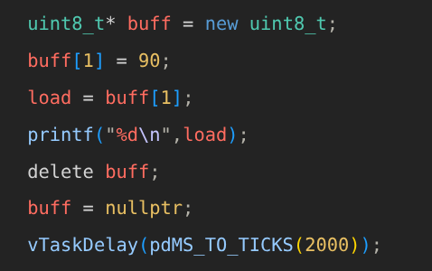
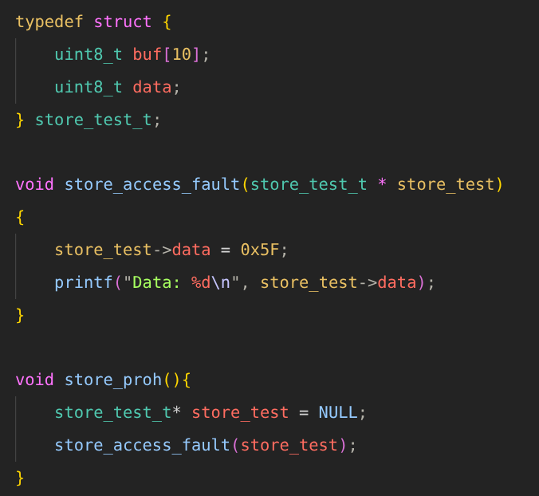
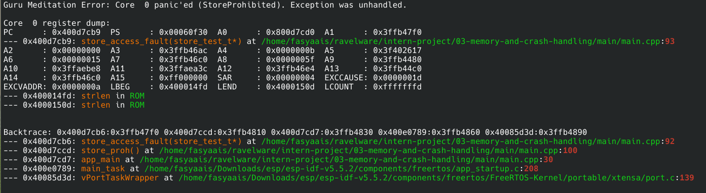
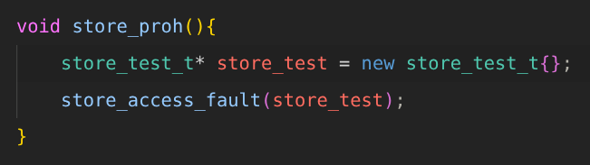
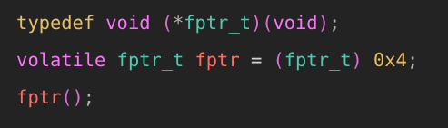
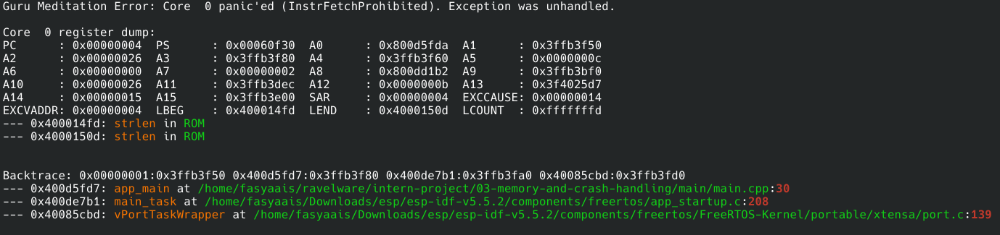
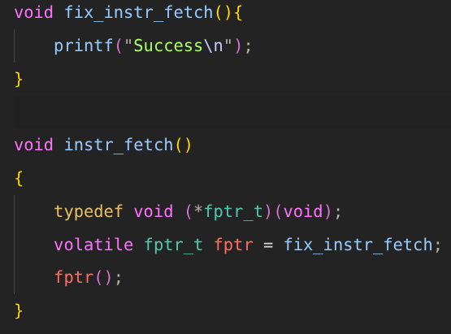

# TASK MINGGU 4
- [x] Demonstrate a stack overflow condition.
- [x] Capture and analyze panic (Guru Meditation) logs.
- [x] Measure heap usage during runtime.
- [x] Implement a fix and explain root cause.

## MEMORY AND CRASH HANDLING
Pada minggu ini akan melakukan mempelajari memori dan jenis-jenis crash pada esp idf.

### Stack Overflow
Stack overflow merupakan kondisi ketika suatu task melebihi stack yang telah di tentukan.

Pada task LED Blink terjadi stack overflow dikarenakan size untuk task kurang/habis, untuk mengatasi hal ini dengan cara menaikkan kapasitas dari task tersebut.

### Guru Meditation Errors
Guru mediation merupakan hasil error yang harus da

Beberapa jenis dari Guru Meditation, yaitu:
1. IllegalInstruction
2. InstrFetchProhibited
3. LoadProhibited, StoreProhibited
4. IntegerDivideByZero
5. Dll.

### Load Access Fault (LoadProhibited)
CPU exception ini terjadi karena suatu aplikasi mencoba membaca dari lokasi memori yang tidak valid.

Error terminal

Hal ini terjadi karena variable load mencoba mengambil nilai dari variable buff yang bernilai sebuah nullptr bukan alamat valid.

Untuk mengatasi ini bisa di inisasikan sebuah alamat valid.****

### Store Access Fault (StoreProhibited)
Store Access Fault terjadi karena suatu aplikasi mencoba menulis dari lokasi memori yang tidak valid.

Error Terminal

Fix

### Instruction Access Fault (InstrFetchProhibited)
Instruction access fault terjadi ketika prosesor mencoba mengeksekusi instruksi dari alamat memori yang tidak valid / tidak boleh dieksekusi

Error Terminal

Fix

