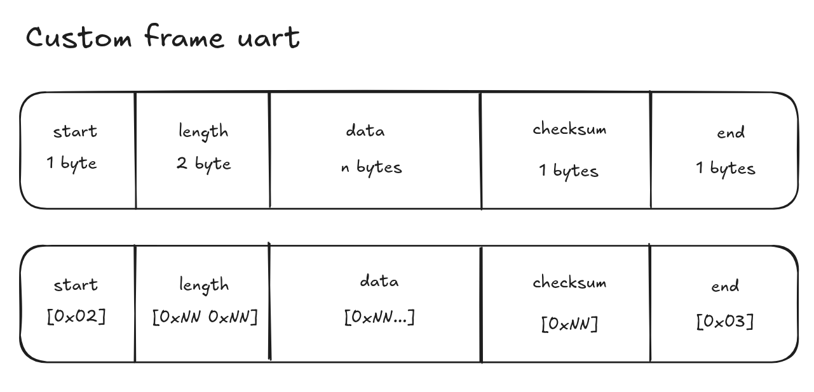
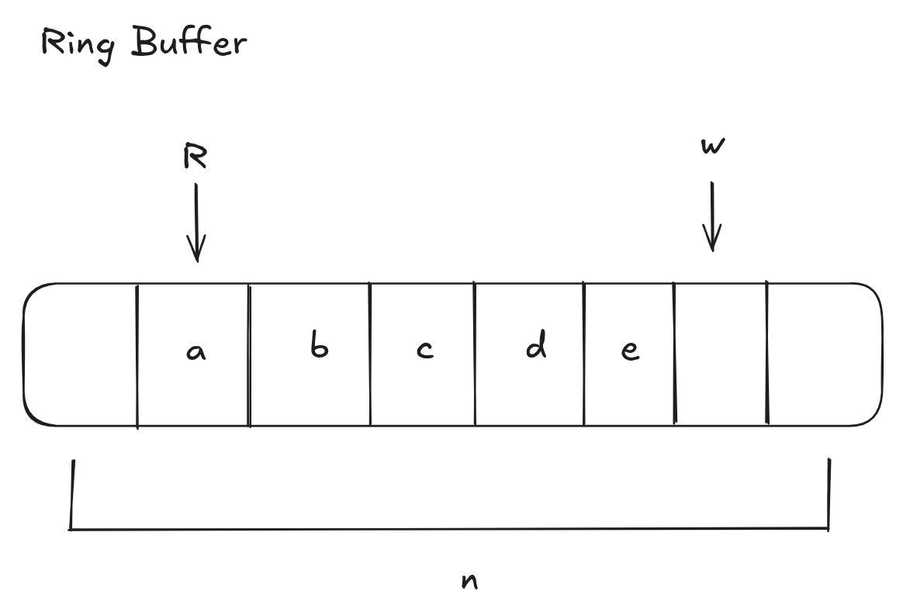
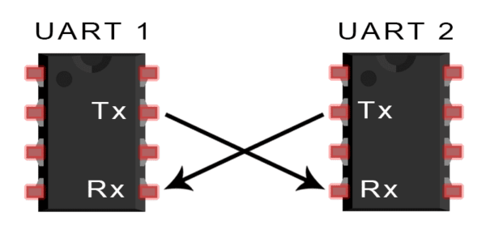
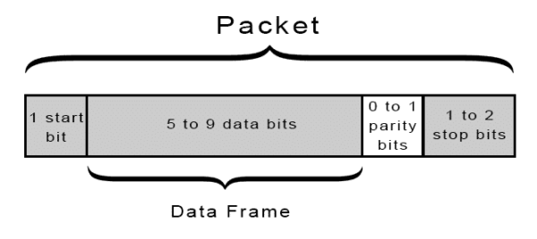
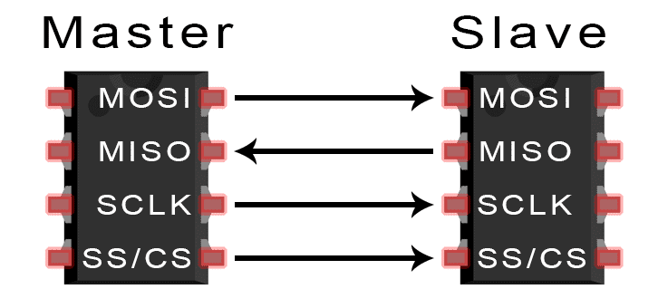
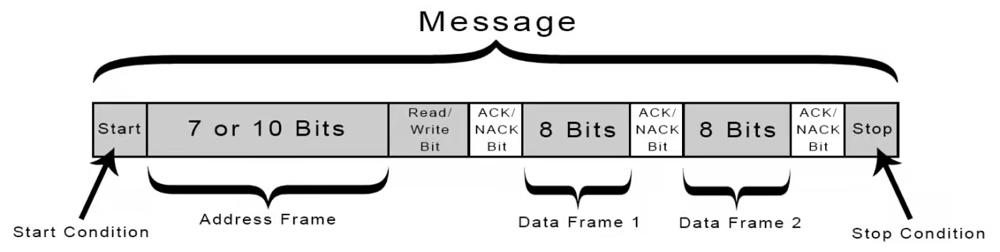

# TASK MINGGU 4
- [x] UART
- [x] Custom Frame
- [x] Read I2C sensor
- [x] SPI communication with display/flash

## Custom Frame

Custom frame digunakan untuk mengirimkan data atau menerima dari dari UART.
Memiliki 5 bagian, yaitu:
- Start \
  Awal mula dari akan diterima dan dibaca
- Length \
  Length akan berisikan panjang dari data. Pada ini memiliki panjang 2 byte atau 65.536 karakter
- Data \
  Data yang dikirimkan 
- Checksum
  Pada bagian ini akan melakukan validasi apakah data yang dikirimkan sesuai dengen diterima. Untuk checksum menggunakan teknik XOR untuk melakukan validasi
- end
  Untuk menutup payload
  
## Ring Buffer
Ring buffer merupakan bagian dari data structure algoritm(DSA). Ring buffer menggunakan fixed size buffer yang ujungnya saling terhubung.

Cara Kerja:
Head (W) Menunjukkan posisi dimana data akan dimasukkan
Tail (R) Menunjukkan dimana posisi kan dibaca

Kelebihan:
Membuat penyimpanan buffer pada memory dapat di trace atau dibaca.

Kekurangan:
Jika buffer penuh, dan akan melakukan push maka data akan hilang/overwrite tergantung bagaimana ring buffer bekerja.

## UART

source: [Circuit Basic](http://circuitbasics.com)

Uart atau universal asyncronus receiver/transmitter
uart bekerja dengan cara asyncronus atau komunikasi 2 arah dengan waktu yang bersamaan. Untuk waktu di melalui baud rate yang sama antara 2 device. UART akan terhubung menggunakan RX dan TX. Receive (RX) akan terhubung ke Transmit (TX) dan sebaliknya

source: [Circuit Basic](http://circuitbasics.com)

Pada pengiriman uart memiliki secara default memiliki format 8n1.
- start bit
- 5-8 data 
- parity
- stop bit

untuk parity memiliki 3 jenis, yaitu: none, odd parity, dan even parity.

## SPI 

source: [Circuit Basic](http://circuitbasics.com)

Serial Peripheral Interface merupakan  komunikasi 1 arah (syncronus) yang berarti harus menunggu dari master ke slave atau sebaliknya.

## I2C

source: [Circuit Basic](http://circuitbasics.com)
Inter integrated circuit merupakan kombinasi dari UART dan SPI. I2C mampu terhubung dengan banyak slaves ke 1 master (seperti SPI) dan master bisa melakukan kontrol ke 1 atau banyak slaves. Seperti UART, i2c menggunakan 2 kabel untuk mengirim data antara device

## MPU 
MPU merupakan sensor yang memiliki accelerometer dan gyroscope dalam 1 IC. MPU menggunakan komunikasi I2C, dengan alamat `0x68`

Alamat:
Accel = 0x3B
Temp = 0x41
Gyro = 0x43